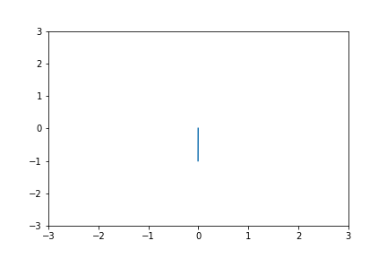

# nopt
Nonlinear optimal control via nonlinear programming (NLP). This library relies upon jax to compute gradients, Jacobian-vector products, and Hessian-vector products through automatic differentiation (AD). Due to calculating gradients through AD as opposed to finite differences, the solution converges in a small number of iterations, but the runtime suffers. In the ideal case, we would find analytical expressions for the gradients, Jacobians, and Hessians (or approximate Hessians).

## Usage

1. First create an optimal control problem by subclassing from the template given in [core.py](nopt/core.py). See [cartpole.py](nopt/problems/cartpole.py) for an example.

``` python
import jax.numpy as np
from nopt.problems import CartPole

cartpole = CartPole()
```

2. Specify boundary conditions and number of grid points:

``` python
bcs = {'x0': jnp.array([0., 0., 0., 0.]),
       'xN': jnp.array([0., 0., jnp.pi, 0.])}
N = 100
```

3. Create a NLP problem:
``` python
from nopt import NlpProblem

problem = NlpProblem(cartpole, boundary_conditions=bcs, N=N)
```
4. Find the optimized solution:

``` python
from nopt import solve

zstar = solve(problem, max_iters=10)
```

You can visualize the optimized output by calling ```plot```:

``` python
anim = problem.plot(zstar)
```

## Example 
See the [example notebook](example.ipynb).


